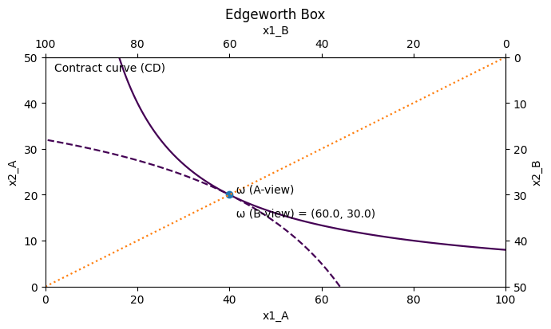

# HW2 2025-2

## **Exchange economy and Marginal products**

### **Part (a)**

#### Problem Definition

There is one non‑money commodity (call it “the good”) and money as the numéraire (its price is normalized to 1). Buyers and sellers have quasi‑linear preferences, so each person chooses the quantity of the good to maximize “utility from the good minus the money spent/received.” In quasi‑linear settings, the optimal interior choice equates marginal utility to the market price of the good; this is the key first‑order condition we will use. Market clearing for the non‑money good requires that the total quantity bought by all buyers equals the total quantity sold by all sellers. These are precisely the competitive‑equilibrium ingredients in our lecture notes on general equilibrium with a numéraire and quasi‑linearity.

All buyers are identical with $$v_b(z_b)=\beta z_b-\tfrac12\gamma z_b^2$$​ for $$z_b\ge 0$$ (and $$-\infty$$ otherwise), all sellers are identical with $$v_s(z_s)=-\tfrac12\sigma z_s^2$$ for $$z_s\le 0$$ (and $$-\infty$$ otherwise), and there are $$M$$ buyers and $$N$$ sellers. We are asked to find the Walrasian price $$p$$ and each agent’s optimal choice $$z_b^{*}$$​ and $$z_s^{*}$$​.

#### Step 1. Individual optimization at price p

**Buyer’s problem** (choose a nonnegative purchase $$z_b$$​):

$$
\max_{z_b\ge 0}\ \ \beta z_b-\tfrac12\gamma z_b^2 - p\,z_b.
$$

**Buyer’s first‑order condition** for an interior optimum ($$z_b>0$$):

$$
\beta-\gamma z_b - p = 0 \quad\Longrightarrow\quad z_b(p)=\frac{\beta-p}{\gamma}.
$$

**Buyer’s nonnegativity constraint** implies the individual demand function:

$$
z_b(p)=\max\Big\{0,\ \frac{\beta-p}{\gamma}\Big\}.
$$

This uses the lecture‑note rule “set $$v'(x)=p$$” under quasi‑linearity (here $$v_b'(z_b)=\beta-\gamma z_b$$​).

**Seller’s problem** (choose a nonpositive supply $$z_s$$​; a negative $$z_s$$​ means selling $$|z_s|$$):

$$
\max_{z_s\le 0}\ \ -\tfrac12\sigma z_s^2 - p\,z_s.
$$

**Seller’s first‑order condition** (the solution automatically satisfies $$z_s\le 0$$ when $$p\ge 0$$):

$$
-\sigma z_s - p = 0 \quad\Longrightarrow\quad z_s(p) = -\frac{p}{\sigma}.
$$

Intuition: the seller increases $$|z_s|$$ until the (positive) marginal money gain $$p$$ equals the marginal disutility $$\sigma |z_s|$$ from parting with more of the good. The FOCs and this interpretation match the numéraire‑plus‑one‑good treatment in our notes.

#### Step 2. Market clearing for the non‑money good

Because the total amount bought must equal the total amount sold, the aggregate feasibility condition is

$$
M\,z_b(p) + N\,z_s(p) = 0.
$$

This is the standard “sum of individual net demands equals zero” condition for the non‑money good in competitive equilibrium.

With the interior buyer demand (which will be valid at the equilibrium we find), substitute $$z_b(p)=(\beta-p)/\gamma$$ and $$z_s(p)=-p/\sigma$$ to get

$$
M\Big(\frac{\beta-p}{\gamma}\Big) + N\Big(-\frac{p}{\sigma}\Big) = 0.
$$

Collecting terms in $$p$$ gives

$$
\frac{M\beta}{\gamma} \;=\; p\Big(\frac{M}{\gamma}+\frac{N}{\sigma}\Big).
$$

#### Step 3. Solve for the Walrasian price p

$$
p^{*} \;=\; \frac{\displaystyle \frac{M\beta}{\gamma}}{\displaystyle \frac{M}{\gamma}+\frac{N}{\sigma}} \;=\; \frac{M\beta\sigma}{M\sigma+N\gamma}.
$$

This price satisfies $$0<p^{*}<\beta$$ when $$M,N,\beta,\gamma,\sigma>0$$, so the buyer solution is indeed interior and the seller solution is nonpositive, as required. (The “interiority $$v'(z)=p$$” and market‑clearing logic are exactly how the notes characterize competitive equilibrium with a numéraire.)

#### Step 4. Plug back to get individual choices​

$$
z_b^{*} = \frac{\beta - p^{*}}{\gamma} = \frac{\beta - \frac{M\beta\sigma}{M\sigma+N\gamma}}{\gamma} = \frac{\beta N}{M\sigma+N\gamma}.
$$

$$
z_s^{*} = -\frac{p^{*}}{\sigma} = -\frac{1}{\sigma}\cdot\frac{M\beta\sigma}{M\sigma+N\gamma} = -\frac{M\beta}{M\sigma+N\gamma}.
$$

A quick check shows market clearing holds agent‑by‑agent totals.

$$
M\,z_b^{*} + N\,z_s^{*} = M\Big(\frac{\beta N}{M\sigma+N\gamma}\Big) + N\Big(-\frac{M\beta}{M\sigma+N\gamma}\Big) = 0.
$$

#### Final answer

$$
\boxed{\,p^{*}=\dfrac{M\beta\sigma}{M\sigma+N\gamma}\,}
$$

$$
\boxed{\,z_b^{*}=\dfrac{\beta N}{M\sigma+N\gamma}\quad\text{for each buyer,}\qquad z_s^{*}=-\dfrac{M\beta}{M\sigma+N\gamma}\quad\text{for each seller.}\,}
$$

A buyer purchases until **marginal benefit** $$(\beta-\gamma z_b)$$ equals **price** $$p$$; a seller sells until the **marginal disutility** $$\sigma|z_s|$$ equals the same price. The equilibrium price balances the total quantity $$M$$ buyers want with the total quantity $$N$$ sellers are willing to release. More buyers $$M$$ or a higher taste parameter $$\beta$$ pushes price up; more elastic buyer side (larger $$\gamma$$) or more elastic seller side (smaller $$\sigma$$) pulls it down. All of this follows the quasi‑linear competitive‑equilibrium template from the notes (money as numéraire, $$v'(x)=p$$, and market clearing).

### **Part (b)**

#### Problem Definition

We want the planner’s “total surplus” from trading the one non‑money good between identical buyers and identical sellers. Each buyer consumes a non‑negative amount $$z_b$$​ and each seller consumes a non‑positive amount $$z_s$$​. With $$M$$ buyers and $$N$$ sellers, feasibility of the non‑money good requires $$M z_b + N z_s = 0$$. The planner’s objective (sum of quasi‑linear utilities) is to maximize $$M v_b(z_b) + N v_s(z_s)$$ subject to that feasibility.

Because preferences are quasi‑linear (utility in money is linear) and strictly concave in the non‑money good, efficiency can be computed by “ignoring money” and maximizing the sum of the non‑money parts under the resource constraint; moreover, the efficient allocation is unique. Intuitively, we will pick one common $$z_b$$​ for all buyers and one common $$z_s$$​ for all sellers by symmetry and concavity.

#### **Step 1. Write the objective and the constraint.**

$$
\max_{z_b \ge 0,\; z_s \le 0}\; M\!\left[\beta z_b - \tfrac{\gamma}{2} z_b^2\right] + N\!\left[-\,\tfrac{\sigma}{2} z_s^2\right]
$$

$$
\text{s.t.}\;\; M z_b + N z_s = 0
$$

Here we used the given quadratic forms $$(z_b)=\beta z_b-\frac{\gamma}{2}z_b^2$$ for buyers and $$v_s(z_s)=-\frac{\sigma}{2}$$​ for sellers.

#### **Step 2. Solve with a Lagrangian.**

$$
\mathcal{L} \;=\; M\!\left[\beta z_b - \tfrac{\gamma}{2} z_b^2\right] + N\!\left[-\,\tfrac{\sigma}{2} z_s^2\right] + \lambda\,(M z_b + N z_s)
$$

First‑order conditions for an interior optimum are:

$$
\frac{\partial \mathcal{L}}{\partial z_b}:\;\; M(\beta - \gamma z_b) + \lambda M = 0 \;\;\Longrightarrow\;\; \beta - \gamma z_b + \lambda = 0
$$

$$
\frac{\partial \mathcal{L}}{\partial z_s}:\;\; N(-\sigma z_s) + \lambda N = 0 \;\;\Longrightarrow\;\; -\sigma z_s + \lambda = 0
$$

$$
\frac{\partial \mathcal{L}}{\partial \lambda}:\;\; M z_b + N z_s = 0
$$

From the first two conditions we get the optimality link:

$$
\gamma z_b - \beta \;=\; \sigma z_s
$$

This says “buyers’ marginal benefit from one more unit” equals “sellers’ marginal harm (in utility units) from giving up one more unit.” With strictly concave $$v$$’s, this first‑order system yields the unique solution.

#### **Step 3. Use feasibility to solve for zb\* and zs\*​.**

$$
z_s \;=\; -\frac{M}{N}\,z_b \quad\Longrightarrow\quad \gamma z_b - \beta \;=\; \sigma\!\left(-\frac{M}{N}z_b\right)
$$

$$
\Big(\gamma + \frac{\sigma M}{N}\Big)z_b \;=\; \beta
$$

$$
\boxed{\,z_b^* \;=\; \frac{\beta}{\,\gamma + \frac{\sigma M}{N}\,}\;=\;\frac{\beta N}{\gamma N + \sigma M}\,}
$$

$$
\boxed{\,z_s^* \;=\; -\,\frac{M}{N}\,z_b^* \;=\; -\,\frac{\beta M}{\gamma N + \sigma M}\,}
$$

These satisfy $$z_b^*\ge 0$$ and $$z_s^*\le 0$$ (since $$\beta>0$$), so the solution is interior and consistent with the domains stated in the problem.

#### **Step 4. Compute the maximum gains from trade.**

Plugging $$z_s = -(M/N)z_b$$​ into the objective collapses it to a single‑variable quadratic in $$z_b$$​:

$$
M\beta z_b \;-\; \frac{1}{2}\Big[\gamma M + \frac{\sigma M^2}{N}\Big] z_b^2
$$

The concave quadratic $$A z - \tfrac{1}{2}B z^2$$ attains its maximum at $$z=A/B$$ with value $$\tfrac{1}{2}\,A^2/B$$. Here $$A=M\beta$$ and $$B=\gamma M + \frac{\sigma M^2}{N}$$​. Therefore,

$$
v_I(0)\;=\;\frac{1}{2}\cdot\frac{(M\beta)^2}{\,\gamma M + \frac{\sigma M^2}{N}\,}
$$

$$
\boxed{\,v_I(0)\;=\;\frac{1}{2}\cdot\frac{M N\,\beta^2}{\gamma N + \sigma M}\,}
$$

This is the **maximum total gains from trade** when buyers and sellers of each type are treated symmetrically, as the note under part (b) presumes.

#### **Intuition**

Quasi‑linearity lets us “separate” money from the real decision and pick the non‑money quantities to maximize the sum of $$v$$’s under the resource constraint. The first‑order condition equalizes the buyers’ marginal benefit to the (absolute) marginal utility cost on the sellers’ side. More buyers $$M$$ push down the per‑buyer quantity $$z_b^*$$​ because each unit must be taken from the fixed pool of sellers; more sellers $$N$$ raise $$z_b^*$$​ because the “sacrifice per seller” is spread thinner. Strict concavity makes the allocation unique.

### Part (c)

#### Problem Definition

Show that the allocation of the non‑money good you found in (a) (the Walrasian competitive equilibrium) coincides with the allocation that maximizes total surplus in (b). Then describe how the set of all Pareto‑optimal allocations relates to the allocation in (a).

#### Step 1 — Write down the competitive‑equilibrium conditions

With a money numéraire (price 1) and one non‑money good, quasi‑linearity lets us solve each agent’s choice by equating “marginal utility” to the market price of the non‑money good. For a representative buyer and seller in this homework:

Buyer’s first‑order condition:

$$
v_b'(z_b)=p
$$

Seller’s first‑order condition (note the seller chooses a non‑positive $$z_s$$​):

$$
v_s'(z_s)=p
$$

Market‑clearing across $$M$$ identical buyers and $$N$$ identical sellers:

$$
M\,z_b+N\,z_s=0
$$

The notes justify these FOCs for quasi‑linear utilities and stress that the money good can be “ignored” when solving the non‑money allocation.

Plug in the specific $$v_b$$​ and $$v_s$$​:

$$
v_b'(z_b)=\beta-\gamma z_b,\qquad v_s'(z_s)=-\sigma z_s.
$$

Thus the competitive‑equilibrium system is:

$$
\beta-\gamma z_b=p,\qquad -\sigma z_s=p,\qquad M z_b+N z_s=0.
$$

Solving gives the Walrasian allocation and price (from part (a)):

$$
z_b^{CE}=\frac{\beta\,N}{\;M\sigma+\gamma N\;}, \qquad z_s^{CE}=-\frac{M\beta}{\;M\sigma+\gamma N\;}, \qquad p^{CE}=\frac{M\beta\,\sigma}{\;M\sigma+\gamma N\;}.
$$

#### Step 2 — Solve the planner’s problem in (b) and compare

Part (b) maximizes total surplus subject to feasibility and symmetry:

$$
\max_{z_b,z_s}\;\; M\,v_b(z_b)+N\,v_s(z_s)\quad\text{s.t.}\quad M z_b+N z_s=0.
$$

Use the constraint $$z_s=-(M/N)\,z_b$$​ and differentiate the objective with respect to $$z_b$$​. The first‑order condition becomes:

$$
M\,v_b'(z_b)-M\,v_s'(z_s)=0\quad\Longleftrightarrow\quad v_b'(z_b)=v_s'(z_s).
$$

Now substitute the derivatives of $$v_b$$​ and $$v_s$$​ and the feasibility relation $$z_s=-(M/N)z_b$$​:

$$
\beta-\gamma z_b = -\sigma z_s = \sigma\Big(\tfrac{M}{N}\Big) z_b.
$$

Hence,

$$
\beta=z_b\Big(\gamma+\sigma\frac{M}{N}\Big)\quad\Longrightarrow\quad z_b^{SP}=\frac{\beta\,N}{\;M\sigma+\gamma N\;},\qquad z_s^{SP}=-\frac{M\beta}{\;M\sigma+\gamma N\;}.
$$

So the surplus‑maximizing allocation $$(z_b^{SP},z_s^{SP})$$ is exactly the same as the competitive‑equilibrium allocation $$(z_b^{CE},z_s^{CE})$$ from Step 1. This is the textbook “equalize marginal benefits across sides subject to feasibility” condition that the notes identify with efficiency; with quasi‑linearity, it coincides with competitive equilibrium.

#### Step 3 — Why the coincidence must hold

In a private‑goods exchange economy with well‑behaved preferences, the First Welfare Theorem (FWT) says any competitive equilibrium allocation is Pareto‑efficient, and the Second Welfare Theorem (SWT) says any Pareto‑efficient allocation can be decentralized as a competitive equilibrium (after suitable lump‑sum money transfers). This is exactly the logic shown in the calculation above: the CE FOCs and the planner’s FOCs deliver the same physical allocation of the non‑money good.

The notes further emphasize that with quasi‑linearity the condition “$$\nabla v_i =$$ prices” pins down a unique efficient physical allocation of the non‑money good (under strict concavity), independently of who holds how much money. Money can be redistributed without changing the non‑money optimum.

#### Step 4 — Characterize the whole set of Pareto‑optimal allocations

Because utilities are quasi‑linear in money:

The physical allocation of the non‑money good that is Pareto‑efficient is **unique** and equals the one you just computed,

$$
z_b^{PE}=\frac{\beta\,N}{\;M\sigma+\gamma N\;},\qquad z_s^{PE}=-\frac{M\beta}{\;M\sigma+\gamma N\;}.
$$

The distribution of money across buyers and sellers can vary freely. Any reallocation of the numéraire (lump‑sum transfers) that keeps the physical quantities at $$(z_b^{PE},z_s^{PE})$$ remains Pareto‑efficient. In the Edgeworth‑box language, the efficient set collapses to a single point in the non‑money dimension, but to a whole “ray” along the money dimension. By the SWT, any point on that ray can be decentralized by suitable endowments and the same relative price for the non‑money good.

#### Final answer

The non‑money allocations from (a) and (b) are identical:

$$
z_b^{*}=\frac{\beta\,N}{\;M\sigma+\gamma N\;},\qquad z_s^{*}=-\frac{M\beta}{\;M\sigma+\gamma N\;}.
$$

### Part (d)

#### Problem Definition

We replicate the one–commodity, quasi‑linear exchange economy in which all buyers share $$v_b(z_b)=\beta z_b-\tfrac{1}{2}\gamma z_b^{2}$$ for $$z_b\ge 0$$ and all sellers share $$v_s(z_s)=-\tfrac{1}{2}\sigma z_s^{2}$$ for $$z_s\le 0$$. Let there be $$M$$ buyers and $$N$$ sellers in the original economy and denote its Walrasian (competitive) price of the non‑money good by $$p$$. In part (d) we consider the $$k$$-replica economy $$v^{\,k}$$ with $$M=N=k$$ and ask to show that its Walrasian price $$p^{\,k}$$ equals $$p$$; in words, the competitive price is invariant to a common replication of agents. The competitive‑equilibrium logic we use is exactly the one in the lecture notes: normalize the price of money to one, have each individual choose the non‑money good by equating marginal utility to its price, and clear the single non‑money market in the aggregate. These are the “individual optimization + market clearing” conditions that define a Walrasian equilibrium in a pure exchange (quasi‑linear) setting.

#### **Step 1 - individual optimal choices at a given price.**

Under quasi‑linearity, the non‑money choice solves “marginal utility equals price.” For a representative buyer this yields the first‑order condition

$$
\beta-\gamma z_b(p)=p,
$$

so the buyer’s demand is

$$
z_b(p)=\frac{\beta-p}{\gamma}\quad\text{for }p<\beta,\qquad z_b(p)=0\ \text{for }p\ge \beta.
$$

For a representative seller, $$v_s'(z_s)=-\sigma z_s$$​ must equal the price, so the seller’s optimal supply is

$$
z_s(p)=-\frac{p}{\sigma}\quad\text{for all }p\ge 0.
$$

These first‑order conditions and the use of money as numéraire are exactly the quasi‑linear demand rules presented in the notes ($$\nabla v$$ equals the price vector for the non‑money goods).

#### **Step 2 - market clearing in the original economy**&#x20;

With $$M$$ identical buyers and $$N$$ identical sellers, the single non‑money market clears when aggregate net demand is zero:

$$
M\,z_b(p)+N\,z_s(p)=0.
$$

Using the formulas from Step 1 and focusing on the trading case $$p<\beta$$ (verified below), this condition is

$$
M\,\frac{\beta-p}{\gamma}+N\left(-\frac{p}{\sigma}\right)=0.
$$

Solving for the competitive price gives

$$
p=\frac{M\sigma\,\beta}{M\sigma+N\gamma}.
$$

Because $$M\sigma+N\gamma>M\sigma$$, this price satisfies $$p<\beta$$, so the interior case we used is internally consistent.

#### **Step 3 - Replication to the k-economy**

In the $$k$$-replica economy $$v^{\,k}$$ we set $$M=N=k$$. Substituting $$M=N=k$$ into the closed‑form equilibrium price above yields

$$
p^{\,k}=\frac{k\sigma\,\beta}{k\sigma+k\gamma}=\frac{\sigma\,\beta}{\sigma+\gamma}=p.
$$

Thus the Walrasian price is invariant to a common replication of the numbers of buyers and sellers; the multiplicative factor $$k$$ cancels from numerator and denominator, leaving the same price as in the unreplicated economy. The result lines up with the general equilibrium insight that, with identical agents and quasi‑linear preferences, each individual’s first‑order condition depends only on prices, while market‑clearing simply scales both sides by the same factor when the economy is replicated. Therefore the equilibrium price does not move.

#### **Intuition**

Competitive prices are determined by where aggregate demand equals aggregate supply. In this quasi‑linear one‑good exchange economy, each side’s best‑response quantity depends only on $$p$$ through the marginal‑utility‑equals‑price conditions, and replicating the economy by a common factor $$k$$ just multiplies the whole demand curve and the whole supply curve by the same number. Multiplying both sides of the market‑clearing equation by $$k$$ leaves its solution for $$p$$ unchanged. Consequently the Walrasian price in the $$k$$-replica, $$p^{\,k}$$, equals the baseline price $$p$$.

### Part (e)

#### **Problem definition**

We are in the one–good, quasi‑linear exchange economy with identical buyers and identical sellers. For part (e), set $$M=N=k$$ and write the economy as $$v^{k}$$. A buyer’s and a seller’s “individual marginal product” are defined as the increase in the maximum total surplus when we add one more buyer (or one more seller) to the economy:

$$
\mathrm{MP}_b(v^{k}) \;:=\; \max\{k\,v_b(z_b)+k\,v_s(z_s): k z_b+k z_s=0\} \;\\ \qquad \qquad \qquad \qquad \ \qquad -\; \max\{(k-1)\,v_b(z_b)+k\,v_s(z_s):(k-1) z_b+k z_s=0\},
$$

$$
\mathrm{MP}_s(v^{k}) \;:=\; \max\{k\,v_b(z_b)+k\,v_s(z_s): k z_b+k z_s=0\} \;\\ \qquad \qquad \qquad \qquad \ \qquad -\; \max\{k\,v_b(z_b)+(k-1)\,v_s(z_s): k z_b+(k-1) z_s=0\}.
$$

The claim to prove is that, in the Walrasian equilibrium of $$v^{k}$$, each individual’s marginal product is strictly larger than that individual’s own maximized utility.&#x20;

#### **Step 1. Equilibrium quantities and price do not depend on k.**

From part (d) (and as a consequence of quasi‑linearity), the competitive price and the individual traded quantity are constant in $$k$$:

$$
p_k \;=\; p \;=\; \frac{\sigma\,\beta}{\sigma+\gamma}, \qquad z_b^{*} \;=\; \frac{\beta}{\sigma+\gamma}, \qquad z_s^{*} \;=\; -\,\frac{\beta}{\sigma+\gamma}.
$$

The first equality says “price equals marginal utility at the optimum,” which is the standard FOC with money as the numéraire; quasi‑linearity also makes the efficient allocation of the non‑money good unique and independent of money holdings.

#### **Step 2. Individual maximized utilities at the Walrasian price.**

A representative buyer’s Walrasian utility is $$v_b(z_b^{*})-p\,z_b^{*}$$. Plugging the expressions above gives

$$
u_b^{\mathrm{W}}(v^{k}) \;=\; \frac{1}{2}\,\frac{\gamma\,\beta^{2}}{(\sigma+\gamma)^{2}}.
$$

A representative seller’s Walrasian utility is $$v_s(z_s^{*})-p\,z_s^{*}$$​, which symmetrically yields

$$
u_s^{\mathrm{W}}(v^{k}) \;=\; \frac{1}{2}\,\frac{\sigma\,\beta^{2}}{(\sigma+\gamma)^{2}}.
$$

#### **Step 3. Total‑surplus (planner) value as a function of the numbers of buyers and sellers.**

Let $$W(m,n)$$ be the maximum of $$m\,v_b(z_b)+n\,v_s(z_s)$$ subject to $$m z_b+n z_s=0$$, treating all buyers identically and all sellers identically (as the problem instructs). Solving the planner’s problem under quasi‑linearity gives a compact closed form:

$$
W(m,n) \;=\; \frac{1}{2}\,\frac{\beta^{2}\,m\,n}{\gamma\,n+\sigma\,m}.
$$

#### **Step 4. Individual marginal products.**

Using the formula for $$W(m,n)$$,

$$
\mathrm{MP}_b(v^{k}) \;=\; W(k,k)-W(k-1,k) \;=\; \frac{1}{2}\,\beta^{2}\left[\frac{k}{\sigma+\gamma} \;-\; \frac{k(k-1)}{\gamma\,k+\sigma\,(k-1)}\right],
$$

$$
\mathrm{MP}_s(v^{k}) \;=\; W(k,k)-W(k,k-1) \;=\; \frac{1}{2}\,\beta^{2}\left[\frac{k}{\sigma+\gamma} \;-\; \frac{k(k-1)}{\gamma\,(k-1)+\sigma\,k}\right].
$$

#### **Step 5. Comparing marginal products to Walrasian utilities.**

For buyers, we must show $$W(vk)\mathrm{MP}_b(v^{k})>u_b^{\mathrm{W}}(v^{k})$$. Divide both sides by $$\tfrac{1}{2}\beta^{2}>0$$ and rearrange the buyer inequality into an equivalent one:

$$
\frac{k}{\sigma+\gamma} \;-\; \frac{k(k-1)}{\gamma\,k+\sigma\,(k-1)} \;>\; \frac{\gamma}{(\sigma+\gamma)^{2}}.
$$

Move the right–hand term to the left and write the remaining left–hand side over a common denominator:

$$
\frac{(k-1)\gamma+k\sigma}{(\sigma+\gamma)^{2}} \;>\; \frac{k(k-1)}{\gamma\,k+\sigma\,(k-1)}.
$$

Cross‑multiplying both sides by the positive denominators and expanding yields

$$
\bigl((k-1)\gamma+k\sigma\bigr)\bigl(\gamma k+\sigma(k-1)\bigr) \;>\; k(k-1)(\sigma+\gamma)^{2}.
$$

The left minus the right simplifies to&#x20;

$$
\gamma\sigma\bigl((k-1)^{2}+k^{2}-2k(k-1)\bigr)=\gamma\sigma\,(k-(k-1))^{2}=\gamma\sigma>0.
$$

Hence the strict inequality holds for every $$k\ge 1$$, proving

$$
\mathrm{MP}_b(v^{k}) \;>\; u_b^{\mathrm{W}}(v^{k}).
$$

A perfectly analogous calculation, swapping $$\gamma$$ and $$\sigma$$, gives for sellers

$$
\mathrm{MP}_s(v^{k}) \;>\; u_s^{\mathrm{W}}(v^{k}).
$$

#### **Final answer.**

In the economy $$v^{k}$$ with quasi‑linear preferences, the Walrasian utilities are

$$
u_b^{\mathrm{W}}(v^{k})=\frac{1}{2}\frac{\gamma\beta^{2}}{(\sigma+\gamma)^{2}},\qquad u_s^{\mathrm{W}}(v^{k})=\frac{1}{2}\frac{\sigma\beta^{2}}{(\sigma+\gamma)^{2}},
$$

whereas the individual marginal products are

$$
\mathrm{MP}_b(v^{k})=\frac{1}{2}\beta^{2}\left[\frac{k}{\sigma+\gamma}-\frac{k(k-1)}{\gamma k+\sigma(k-1)}\right],\quad \mathrm{MP}_s(v^{k})=\frac{1}{2}\beta^{2}\left[\frac{k}{\sigma+\gamma}-\frac{k(k-1)}{\gamma(k-1)+\sigma k}\right].
$$

For every $$k\ge 1$$ these satisfy $$\mathrm{MP}_b(v^{k})>u_b^{\mathrm{W}}(v^{k})$$ and $$\mathrm{MP}_s(v^{k})>u_s^{\mathrm{W}}(v^{k})$$. Therefore, in Walrasian equilibrium each individual’s marginal product strictly exceeds that individual’s own maximized utility.

### Part (f)

#### Problem definition

We are in the one–good exchange economy with money as numéraire. Each buyer chooses a non‑money quantity $$z_b \ge 0$$ and has quasi‑linear utility $$v_b(z_b)=\beta z_b-\tfrac12\gamma z_b^2$$​. Each seller chooses $$z_s\le 0$$ and has quasi‑linear utility $$v_s(z_s)=-\tfrac12\sigma z_s^2$$​. With $$M$$ buyers and $$N$$ sellers the feasibility constraint is $$M z_b+N z_s=0$$. In parts (d)–(e) we specialized to a $$k$$-replica economy with $$M=N=k$$ and defined the individual marginal products $$MP_b(v_k)$$ and $$MP_s(v_k)$$.

Part (f) asks you to show that $$MP_i(v_k)$$ converges to the individual maximized utility at the Walrasian equilibrium as $$k\to\infty$$.

#### **Step 1 (Competitive benchmark in the replica economy).**&#x20;

Under quasi‑linearity, each buyer facing price $$p$$ solves $$\max_{z_b\ge 0}\{\beta z_b-\tfrac12\gamma z_b^2-p z_b\}$$, so the individual demand is $$z_b(p)=\max\{0,(\beta-p)/\gamma\}$$. Each seller solves $$\max_{z_s\le 0}\{-\tfrac12\sigma z_s^2-p z_s\}$$, yielding $$z_s(p)=-p/\sigma$$. Market‑clearing with $$M$$ buyers and $$N$$ sellers requires $$z_b(p)+N z_s(p)=0$$. These are precisely the first‑order conditions you get from “money as residual good” in our quasi‑linear note.

For the kkk-replica economy with $$M=N=k$$, the Walrasian price and individual allocations are

$$
p^*=\frac{\beta\sigma}{\gamma+\sigma},\qquad z_b^*=\frac{\beta}{\gamma+\sigma},\qquad z_s^*=-\frac{\beta}{\gamma+\sigma}.
$$

The corresponding individual maximized utilities (the quasi‑linear “surpluses”) are

$$
u_b^{CE}=v_b(z_b^*)-p^* z_b^*=\frac{(\beta-p^*)^2}{2\gamma}=\frac{\beta^2\gamma}{2(\gamma+\sigma)^2},
$$

$$
u_s^{CE}=v_s(z_s^*)-p^* z_s^*=\frac{(p^*)^2}{2\sigma}=\frac{\beta^2\sigma}{2(\gamma+\sigma)^2}.
$$

Because preferences are strictly concave and quasi‑linear, the Walrasian allocation coincides with the planner’s efficient allocation (First Welfare Theorem), so these are also the individually achieved utilities at the efficient point.

#### **Step 2 (A closed‑form planner value for arbitrary M,N).**&#x20;

Consider the social planner’s problem $$\max_{z_b,z_s}\{M v_b(z_b)+N v_s(z_s)\}$$ subject to $$M z_b+N z_s=0$$. Substituting $$z_s=-(M/N) z_b$$​ and optimizing in one variable gives the optimal buyer quantity

$$
z_b^{*}(M,N)=\frac{\beta}{\gamma+(\tfrac{M}{N})\sigma}.
$$

Plugging back, the maximized total surplus is

$$
W(M,N)=\max\{M v_b+N v_s\}=\frac{M\beta^2}{2\bigl[\gamma+(\tfrac{M}{N})\sigma\bigr]}.
$$

By the welfare theorem, this value is also the total competitive surplus at the Walrasian equilibrium for the $$(M,N)$$ economy.

#### **Step 3 Exact formulas for MPi(vk) and the limits.**&#x20;

For buyers, use the definition $$MP_b(v_k)=W(k,k)-W(k-1,k)$$ and the closed form for $$W(M,N)$$. A short algebraic simplification yields the exact identity

$$
MP_b(v_k)=\frac{\beta^2}{2}\left[\frac{k}{\gamma+\sigma}-\frac{k-1}{\gamma+\sigma-\frac{\sigma}{k}}\right] =\frac{\beta^2}{2}\cdot\frac{\gamma}{(\gamma+\sigma)\bigl(\gamma+\sigma-\frac{\sigma}{k}\bigr)}.
$$

Taking the limit as $$k\to\infty$$ gives

$$
\lim_{k\to\infty} MP_b(v_k)=\frac{\beta^2}{2}\cdot\frac{\gamma}{(\gamma+\sigma)^2} =\frac{\beta^2\gamma}{2(\gamma+\sigma)^2}=u_b^{CE}.
$$

For sellers, use $$MP_s(v_k)=W(k,k)-W(k,k-1)$$. The same approach gives the exact expression

$$
MP_s(v_k)=\frac{\beta^2}{2}\left[\frac{k}{\gamma+\sigma}-\frac{k}{\gamma+\sigma+\frac{\sigma}{k-1}}\right] =\frac{\beta^2}{2}\cdot\frac{\sigma\,\frac{k}{k-1}}{(\gamma+\sigma)\bigl(\gamma+\sigma+\frac{\sigma}{k-1}\bigr)}.
$$

Hence

$$
\lim_{k\to\infty} MP_s(v_k)=\frac{\beta^2}{2}\cdot\frac{\sigma}{(\gamma+\sigma)^2} =\frac{\beta^2\sigma}{2(\gamma+\sigma)^2}=u_s^{CE}.
$$

These limits are exactly the individual maximized utilities computed in Step 1 for the Walrasian equilibrium of the replica economy. This shows $$MP_i(v_k)\to u_i^{CE}$$​ for both buyers and sellers, as required by part (f).

#### **Final answer.**&#x20;

For $$M=N=k$$, the buyer and seller marginal products admit the exact closed forms

$$
MP_b(v_k)=\frac{\beta^2}{2}\cdot\frac{\gamma}{(\gamma+\sigma)\bigl(\gamma+\sigma-\frac{\sigma}{k}\bigr)},\qquad MP_s(v_k)=\frac{\beta^2}{2}\cdot\frac{\sigma\,\frac{k}{k-1}}{(\gamma+\sigma)\bigl(\gamma+\sigma+\frac{\sigma}{k-1}\bigr)}.
$$

Therefore,

$$
\lim_{k\to\infty}MP_b(v_k)=\frac{\beta^2\gamma}{2(\gamma+\sigma)^2}=u_b^{CE},\qquad \lim_{k\to\infty}MP_s(v_k)=\frac{\beta^2\sigma}{2(\gamma+\sigma)^2}=u_s^{CE}.
$$

This completes the proof that $$MP_i(v_k)$$ converges to the individual maximized utility at the Walrasian equilibrium as $$k\to\infty$$.

## Strategic waste in GE

### Part (a)

#### **Set‑up.**&#x20;

There are two consumers A and B in a pure exchange economy with two goods, $$X$$ and $$Y$$. Preferences are Leontief and identical across consumers,

$$
U_A(x_A,y_A)=\min\{x_A,y_A\},\qquad U_B(x_B,y_B)=\min\{x_B,y_B\}.
$$

Endowments are $$(e_A^X,e_A^Y)=(4,0)$$ and $$(e_B^X,e_B^Y)=(0,4)$$. Normalize the price of $$Y$$ to one and denote the price of $$X$$ by $$p>0$$. This is exactly the environment stated in “Strategic waste in GE,” part (a).

#### **Step 1 (individual demand at given prices).**&#x20;

With Leontief utility, each consumer only wants to consume equal amounts of the two goods. At prices $$(p,1)$$, buying one “matched pair” $$(1,1)$$ costs $$p+1$$. If consumer iii has income $$m_i$$​, her Marshallian demand therefore satisfies

$$
x_i = y_i = \frac{m_i}{p+1}.
$$

Income is the value of the individual endowment at prevailing prices, so

$$
m_A = p\cdot 4 + 1\cdot 0 = 4p,\qquad m_B = p\cdot 0 + 1\cdot 4 = 4.
$$

Hence each consumer’s optimal bundle at $$(p,1)$$ is

$$
x_A = y_A = \frac{4p}{p+1},\qquad x_B = y_B = \frac{4}{p+1}.
$$

This uses the standard competitive‑equilibrium budget‑maximization set‑up from the lecture notes (prices $$(p_1,p_2)$$, budget lines through endowments, and demand chosen to maximize utility subject to the budget).

#### **Step 2 (market clearing and the equilibrium condition).**&#x20;

Aggregate demand for each good equals

$$
X^d = x_A + x_B = \frac{4p}{p+1}+\frac{4}{p+1} = 4,
$$

$$
Y^d = y_A + y_B = \frac{4p}{p+1}+\frac{4}{p+1} = 4.
$$

Aggregate endowments are $$(X^s,Y^s)=(4,4)$$. Thus $$X^d=X^s$$ and $$Y^d=Y^s$$ for every $$p>0$$. Because each consumer is maximizing subject to her budget and both markets clear, $$(p,1)$$ with the allocation derived above is a competitive (Walrasian) equilibrium. This matches the definition of a competitive equilibrium in an exchange economy—prices and an allocation such that, given prices and endowments, each consumer optimizes and markets clear.

#### **Step 3 (Edgeworth‑box illustration).**&#x20;

<figure><figcaption></figcaption></figure>

The initial endowment point is the southeast corner (A holds $$(4,0)$$ and B holds $$(0,4)$$). For any price ratio $$p/1$$, the common price line is the straight line through the endowment point with slope $$−p$$ in A’s coordinates. A’s indifference curves are L‑shaped with kinks along the 45‑degree line $$x_A=y_A$$​; B’s are the same, mirrored from her origin. At the equilibrium price $$(p,1)$$, each consumer chooses the kink on her budget line; geometrically, the equilibrium allocation is the intersection of the price line through the endowment with the main diagonal $$x_A=y_A$$​, which yields

$$
(x_A,y_A)=\left(\frac{4p}{p+1},\frac{4p}{p+1}\right),\qquad (x_B,y_B)=\left(\frac{4}{p+1},\frac{4}{p+1}\right).
$$

As $$p$$ increases, that point slides up the diagonal toward $$(4,4)$$ for A (and toward $$(0,0)$$ for B); as $$p$$ decreases toward zero, it slides down the diagonal toward $$(0,0)$$ for A (and toward $$(4,4)$$ for B). This is the standard Edgeworth‑box picture the notes use—competitive equilibria are supported by a price line that passes through the endowment and are located where both consumers’ best responses coincide; with Leontief preferences the contract curve is the 45‑degree diagonal.

### Part (b)

#### **Problem statement.**&#x20;

Show that for any Walrasian equilibrium with a strictly positive, finite relative price ppp of good $$X$$ (with the price of $$Y$$ normalized to $$1$$), neither consumer $$A$$ nor consumer $$B$$ receives his or her marginal product. The economy is the one in the assignment: $$U_A(x_A,y_A)=\min\{x_A,y_A\}$$  $$U_B(x_B,y_B)=\min\{x_B,y_B\}$$, endowments $$(e^X_A,e^Y_A)=(4,0)$$, $$(e^X_B,e^Y_B)=(0,4)$$, and a Walrasian equilibrium is a price–allocation pair that clears markets and solves each consumer’s utility maximization problem given the budget implied by her endowment at prices $$(p,1)$$.

#### **Step 1 (Recover the Walrasian equilibrium allocations as a function of p).**

With Leontief preferences $$\min\{x,y\}$$, each consumer demands equal amounts of the two goods along the 45° “perfect-complements” diagonal of the Edgeworth box. Given income $$I_i$$​, the optimal bundle for consumer $$i\in\{A,B\}$$ solves $$px_i + 1\cdot y_i \le I_i$$ with $$x_i=y_i$$, hence $$x_i=y_i=I_i/(p+1)$$. At prices $$(p,1)$$, the incomes generated by endowments are

$$
I_A=4p,\qquad I_B=4.
$$

Therefore the Walrasian demands are

$$
x_A(p)=y_A(p)=\frac{4p}{p+1},\qquad x_B(p)=y_B(p)=\frac{4}{p+1}.
$$

Market clearing holds for every $$p\in(0,\infty)$$ because $$x_A(p)+x_B(p)=4$$ and $$y_A(p)+y_B(p)=4$$. Thus there is a whole continuum of Walrasian equilibria indexed by $$p>0$$, all lying on the contract curve $$x_i=y_i$$​. The associated utilities are

$$
U_A(p)=\min\{x_A,y_A\}=\frac{4p}{p+1},\qquad U_B(p)=\min\{x_B,y_B\}=\frac{4}{p+1}.
$$

These are standard consequences of the Walrasian consumer problem and market clearing in a two-good exchange economy, visualized in the Edgeworth box.

#### **Step 2 (Define and compute each consumer’s marginal product in this economy).**

By “marginal product” in an exchange economy we mean an agent’s _marginal social contribution_: the increase in the planner’s objective when the agent (and her endowment) is present versus absent. With Leontief utilities, the utilitarian planner’s problem is to maximize $$U_A+U_B$$​ subject to feasibility. With both $$A$$ and $$B$$ present and total resources $$(4,4)$$, the best feasible allocation sets $$x_A=y_A=2$$ and $$x_B=y_B=2$$, attaining

$$
W(A+B)=U_A+U_B=2+2=4.
$$

If only $$B$$ were present, the economy would have resources $$(0,4)$$, and any feasible allocation yields $$U_B=\min\{x_B,y_B\}=0$$. Hence

$$
W(B\ \text{only})=0.
$$

Symmetrically, with only $$A$$ and resources $$(4,0)$$, one obtains $$W(A\ \text{only})=0$$. It follows that each individual’s marginal product (marginal social contribution) equals

$$
\text{MP}_A=W(A+B)-W(B\ \text{only})=4,\\\text{MP}_B=W(A+B)-W(A\ \text{only})=4.
$$

This “marginal product as marginal contribution” notion is the same idea that underlies the Clarke/VCG construction, where net utilities are engineered to equal agents’ marginal products.

#### **Step 3 (Compare Walrasian utilities to marginal products).**

For any $$p\in(0,\infty)$$, the Walrasian utilities from Step 1 satisfy

$$
U_A(p)=\frac{4p}{p+1}<4,\qquad U_B(p)=\frac{4}{p+1}<4,
$$

since $$p/(p+1)<1$$ and $$1/(p+1)<1$$ for all finite $$p>0$$. Thus neither consumer receives her marginal product in any Walrasian equilibrium with $$p\in(0,\infty)$$. In other words, while all such equilibria are Pareto efficient in the sense of the First Welfare Theorem, the competitive outcome simply _splits_ the total surplus according to endowment-valuations at $$(p,1)$$; it does not compensate each agent by her full marginal social contribution.

#### **Final answer.**

For every Walrasian equilibrium with $$p\in(0,\infty)$$, the utilities are $$U_A(p)=4p/(p+1)$$ and $$U_B(p)=4/(p+1)$$, while the marginal products are $$\text{MP}_A=\text{MP}_B=4$$. Hence $$U_A(p)<\text{MP}_A$$​ and $$U_B(p)<\text{MP}_B$$​ for all such equilibria, as required.

